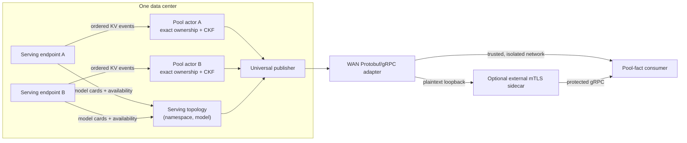

**Experimental.** NVIDIA Dynamo's DC KV Relay exports compact facts about a data center's
key-value (KV) cache and serving topology. It keeps exact block ownership local and publishes a
Cuckoo-filter (CKF) projection for each pool, avoiding replication of every worker's full event
stream across the WAN. Consumers decide how to query and use the published facts.

For deployment, see [Deploy the DC KV Relay](../../../../kubernetes/kv-aware-routing/kv-dc-relay.md).
For flags and defaults, see [DC KV Relay Configuration](../../../../reference/components/kv-dc-relay-configuration.md).
This page describes the system model; the
[Rust implementation guide](https://github.com/ai-dynamo/dynamo/blob/main/lib/llm/src/kv_dc_relay/docs/architecture.md)
describes actors, hubs, admission, and teardown.

## Architecture



Relay runs as a Dynamo component: its Python entrypoint creates the shared runtime and manages
the Rust host's lifecycle. The host discovers workers and maintains two independent projections:

- **Pool catalog:** endpoint-local physical KV pools and their current producer generations.
- **Serving topology:** model readiness grouped by `(namespace, canonical_model_id)`.

A topology member links to its pool by stable `KvPoolId`; consumers resolve the current producer
through the catalog. A member can contribute serving dependencies without owning a physical pool.
Pool presence alone never implies that the model is ready.

Independent endpoints remain separate even when they advertise the same model. Combining their
KV state would make a hit ambiguous: a consumer could choose one endpoint while the matching
prefix exists only in another.

## Pool and Producer Identity

An indexer domain combines cache semantics with a routing-isolation scope. The normal derived
routing scope includes the serving endpoint identity; an explicit indexer identity can override
that derivation. Adding the logical data center forms a stable pool identity:

```text
PoolId = (identity_version, IndexerDomainId, DcId)
```

`ProducerIdentity` identifies a particular generation and CKF layout of that pool. A replacement
generation requires a new consumer snapshot. `RelayIdentity` separately identifies the runtime
and Relay incarnation. Descriptor metadata, including the serving endpoint, does not extend the
subscription key. The serving endpoint is not an inference ingress.

If two live endpoints resolve to the same `PoolId`, Relay fences that identity rather than merging
their state. A pool materializes only when discovery provides a valid domain and registration,
an unambiguous recovery endpoint, and at least one active KV event source. Losing those conditions
withdraws the pool; its endpoint may remain in serving topology without a pool link.

Exact key fields and compatibility rules belong to the
[gRPC contract](https://github.com/ai-dynamo/dynamo/blob/main/lib/llm/src/kv_dc_relay/docs/grpc-contract.md#producer-identity-key).

## Canonical Models and LoRA

Each endpoint pool has one canonical base-model target and can advertise Low-Rank Adaptation
(LoRA) targets backed by that model. Registrations include aliases, but the Relay does not
publish a derived model-to-pool or alias-to-model lookup index.

Base and adapter KV entries share one physical CKF and use distinct hash salts. Adapter readiness
is nested under the base model: the base can be ready while a particular adapter is unavailable.
Consumers derive their own lookup indexes; a name resolving to conflicting targets must not be
arbitrated by arbitrary first-wins ordering.

## Aggregated, Prefill/Decode (PD), and Encode/Prefill/Decode (EPD) Topologies

| Deployment | Pools | Serving topology |
| --- | --- | --- |
| Aggregated | One pool per KV-publishing endpoint | Aggregated workers satisfy the model's serving role. |
| Prefill/decode (PD) | Separate Prefill and Decode pools | Readiness evaluates both roles together. |
| Encode/prefill/decode (EPD) | Separate pools for endpoints with active KV event sources | Encode contributes a dependency even when it has no pool. |

Both Prefill and Decode CKFs are meaningful. Compute request hashes separately for each pool
using its declared query semantics; their formats can differ. Encode contributes a pool only
while it advertises an active KV event source. It remains a base-model dependency, not an
adapter-bearing role; adapter membership applies to Prefill, Decode, and Aggregated roles.

## WAN API

The Protobuf/gRPC adapter exposes four independent data streams: catalog, pool filters, serving
readiness, and pool load. It also provides a Relay identity query. It consumes the universal
publisher's state watches and encoded frames, without maintaining a second CKF mirror or
publication pipeline.

RPC schemas, message validation, versioning, errors, and reconnect rules are specified in the
[gRPC contract](https://github.com/ai-dynamo/dynamo/blob/main/lib/llm/src/kv_dc_relay/docs/grpc-contract.md).
The adapter does not provide an overlap RPC or cross-data-center request-routing policy.

## CKF Publication

The pool actor tracks exact full-hash ownership per worker/rank and refcounts shared hashes.
The CKF records whether at least one owner holds a hash, not how many workers own it. Full hashes
stay local because fingerprints are lossy and have no owner identity.

The universal publisher provides an initial snapshot followed by contiguous deltas. It owns
lazy publication hubs, bounded queues, snapshot encoding, and generation fencing. The WAN adapter
forwards its Cuckoo Bucket Images v1 (CBI1) payloads and adds transport envelopes and heartbeats.

A consumer reconstructs each pool's CKF from snapshots and deltas and chooses its own storage
layout and query strategy. The publication contract does not require a particular consumer
implementation or use case. Endpoint resolution and request forwarding are outside its scope.

A CKF match indicates possible prefix presence, not proof of a reusable prefix. Fingerprints can produce
false positives; a capacity failure can also cause an omission. Publication and consumer recovery
preserve stream consistency, not an exact remote copy of every worker's ownership index.

## Serving Readiness

The topology evaluator shares Dynamo's namespace-wide worker dependency semantics:

- `READY`: at least one worker is live and required roles are satisfied.
- `UNAVAILABLE`: availability is authoritative but a required role or live worker is missing.
- `UNKNOWN`: a participating endpoint has not yet produced an authoritative availability snapshot.

Legacy cards use the compatibility fallback of any live worker and expose that weaker gating.
Duplicate Prefill/Decode roles are reported as a topology fact, not a version-independent failure
verdict. LoRA readiness additionally checks adapter membership on the applicable roles.
Mapping a ready model to an inference ingress remains consumer or deployment policy.

## Pool Load

Load describes worker-authoritative KV occupancy and expected/observed rank coverage. Missing
observations and unknown capacity are not zero load. Router-local scheduler events are excluded
because they lack the publisher identity needed for aggregation across router replicas.

Complete rank coverage does not establish per-rank freshness: the producer can retain a rank's
last observation. A fresh WAN window proves neither that the rank is still live nor that its
occupancy was just measured. Consumers need a fallback for unavailable or insufficient evidence.

## Recovery Boundaries

Recovery is scoped to the affected state: a worker event gap rebuilds that rank, a fenced pool
withdraws its producer generation, and a disconnected consumer stream rebuilds only its own view.
Catalog, pool, readiness, and load do not share one global revision or reconnect transaction.

For producer invariants, see the
[implementation guide](https://github.com/ai-dynamo/dynamo/blob/main/lib/llm/src/kv_dc_relay/docs/architecture.md).
For consumer actions, see the
[contract lifecycle rules](https://github.com/ai-dynamo/dynamo/blob/main/lib/llm/src/kv_dc_relay/docs/grpc-contract.md#consumer-lifecycle-rules).

## Transport

The WAN listener is optional and serves plaintext HTTP/2 gRPC. Without it, local discovery and
pool maintenance continue. Listener configuration and limits are in the
[configuration reference](../../../../reference/components/kv-dc-relay-configuration.md).

### Optional mTLS Sidecar

Transport security belongs to an external proxy, not Relay. For certificate handling, protected
exposure, and probe changes, see the
[Kubernetes sidecar procedure](../../../../kubernetes/kv-aware-routing/kv-dc-relay.md#optional-mtls-sidecar).
